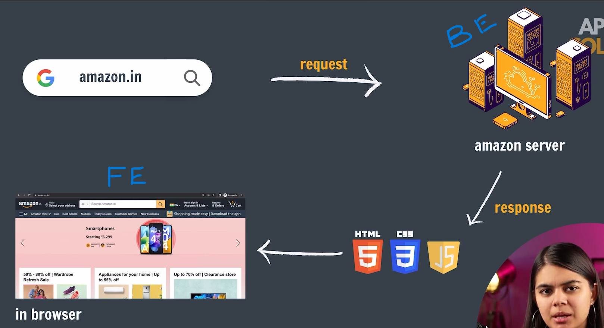
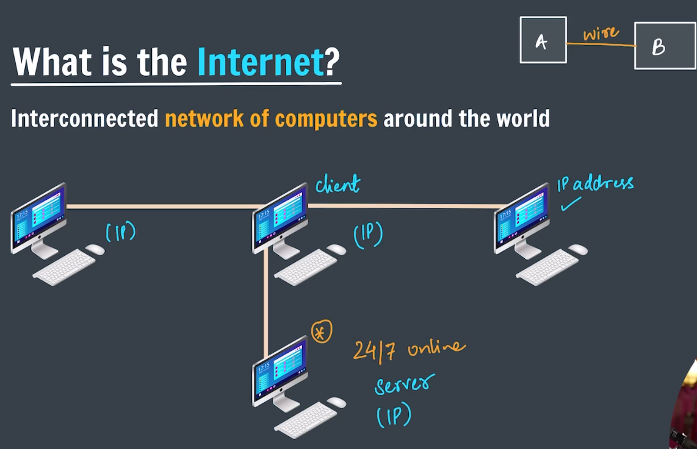

# INTRO

---

### `Always BE CONSISTENT with DISCIPLINE`

- CONSISTENT → Complete all the BACKLOGS within 2 days only & Don’t lose your 2-DAY Streak.
- DISCIPLINE → Fix your TIME from your available time & Be SURE to give that TIME to DELTA.

<aside>
💡 But, DO NOT keep Backlog

And remember CONSISTENCY & DISCIPLINE are KEY to Everything

Both of these must be maintained even during exams, trips & bad health conditions.

</aside>

---

## What is Internet..?

- `Interenet` → Interconnected network of computers around the world

<aside>
💡

### What do you mean by Network of computers..?

- Network of computers also known as "Computer Network"
- `CN` → It represents "The Area in which computers are connected together & can communicate with each other"

### How these network of computers communicate & share information..?

- They uses standard protocols to communicate & share information with Each Other

### What is a Protocol..?

- `Protocol` → standardized set of rules for formatting and processing data.
- Protocols enable computers to communicate with one another.
</aside>

Out of these many computers, 

- there will be one (or) many special computer(s) which will be online 24/7
- These computers will continuously send the data to the required computers whenever asked/requested
- That computer is called server.
    - SERVER → A special computer/Machine which will serve the requested data [requests] to a specific computer.
    - CLIENT → Any Computer/Machine which requests the data from the Server.

But, An IP address is mandatory for a client system whenever it requests some data from the hosting system.

`IP Address` → A unique identifying number assigned to every device connected to the internet

- ex: 118.214.252.60 → Notion’s website [where I’m actually writing this Notes] address
- This IP address is provided to us by ISP’s [Internet Service Provider]

Similarly there will be so many websites in the world like google.com, amazon.com… and their respective IP address’s.

It will be very hard to remember those address to search for required content/data. [Since Humans are less likely to remember Numbers compared to Names]

i.e., why we had a system called DNS [Domain Name System], which has all the IP address’s and maps those with some names called Domain names [like Google.com, Amazon.com]

- [Google.com](http://Google.com) → 142.250.189.174
- [Amazon.com](http://Amazon.com) → 52.94.236.248
- [facebook.com](http://facebook.com) → 157.240.22.35
    - we can get these above results from [https://www.nslookup.io/](https://www.nslookup.io/)

Hence, we will search using Domain names and DNS will fetch the IP address mapped to that corresponding domain name and connects to that website to get the data.

<aside>
💡

NOTE:

---

- Every Client Request will be First received by ISP
- ISP gets the IP Address from DNS
    - `DNS` → Maps all the IP Address with their respective Domain Names
- Once IP Address is retrieved, Then Request is sent to respective Machine for data
- Finally Server will serve the requested data back to Client
</aside>

---

## What is Web Development..?

Building websites for the Internet.

Analogy:

- Just like when customer requests/orders food in a restaurant,
- A waiter will take the request & send it to required person called chef.
- Chef prepares the food for us and is sent to customer via server.
- customer → client || waiter→ API || chef → website’s server computer || food → data

similarly, 

- User requests the data from a browser,
- That request is sent to that website’s server like Amazon’s server via API call,
- Amazon server will give response to that request.
    - This response will be a code in “HTML, CSS & JS”.
- Browser understands that response & renders the code into a webpage which is displayed to end-user.
- This is called request-response cycle.

Request-Response cycle.

---

## IP Address

- `IP Address` → A unique identifying number assigned to every device connected to the internet
    - The **main use of an IP address** is to **identify and locate devices** on a network (like the Internet) so they can **communicate with each other**.
    - It is a protocol for addressing & routing the packets of data to their correct destination

Main Purpose

1. Device Identification
    - Every device (computer, smartphone, server, etc.) gets a unique IP address.
    - Hence, **IP address** is used to **identify and locate devices** on a network
2. Routing Data
    - Routers use IP addresses to send data packets to the correct destination.
3. **Security & Control**
    - Network administrators use IP addresses to:
        - Block unwanted traffic
        - Monitor activity
        - Allow or deny access to certain users

IP Versions

- **IPv4**:
    - consists of four numbers [0 - 225], with a single dot (.) separating each number
    - An IPv4 looks something like this: `192.168.1.1`
- **IPv6** (newer version):
    - consists of eight groups of four hexadecimal digits.
    - An IPv6 looks something like this: `2001:0db8:85a3:0000:0000:8a2e:0370:7334`

Types of IP Address

1. **Public IP address** – Used on the Internet (visible to the world).
2. **Private IP address** – Used inside home or office networks (not visible publicly).
3. **Static IP** – Doesn’t change.
4. **Dynamic IP** – Changes from time to time, assigned by your Internet Service Provider (ISP).