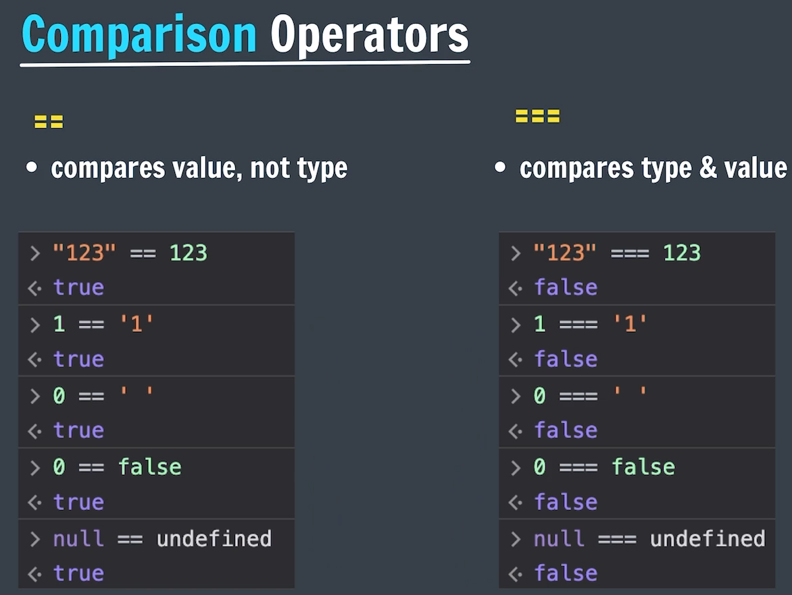

# JS II

---

## Console.log( )

- To Print ( log ) a message on the console window
- This is similar to like `System.out.print( )` in java
- This is useful in scenarios where JS file is linked with HTML file, to print on console window

```jsx
console.log("Apna College");
console.log(1234);
console.log(2+5);
console.log("Apna", "College", 123);            // o/p -> Apna College 123

console.log("THe price is", 5 + 10, "Rupees");  //what is the O/P..?
```

<aside>
💡

NOTE:

---

- We can use “comma ( `,` )” operator to concatenate in console.log( )
    - This comma operator automatically adds a space during concatenation.
- Where as if we use `+` operator to concatenate in Strings, it Won’t add
</aside>

## Linking JS File

- `<script>` tag is used to link JS file with HTML file
- But, always write the linking statement at the last statement inside the `body` tag [ Not Mandatory ]
- `console.log( )` is very useful in this scenario
    - Whatever the `console.log( )` statements present in JS file will only be seen in the linked HTML webpage
    - In other web pages, those log messages are not seen [ as the JS file is linked to that particular HTML page ]

```jsx
<body>
	<!-- All the code & then last statement as linkage file -->
	<script src="app.js"></script>
</body>
```

## Why is JS file placed inside the body..?

- You can add the `<script> </script>` tag **inside either the `<head></head>` section** or **the `<body></body>`** of your HTML document.
- However, it's recommended to add scripts to the bottom of the `<body>` element because it can reduce webpage's load time.
    - Doing this allows the rest of the page [ HTML & CSS ] to load before loading the JavaScript files, which can be large.
    - This reduce the page load time && improves UX [ As UI will be displayed immediately & JS will be loaded in background ]

## Why is CSS code placed inside the head..?

- Because, it should be loaded before the page content loads
- The HTML code inside the body of the document is loaded progressively from top to bottom,
- Placing it in the head ensures that it is loaded before the page begins rendering.
    - Otherwise, 1st html code is rendered. Then CSS is loaded & html needs to be rendered again by the browser.
    - Hence performance decreases as rendering occurs twice.

<aside>
💡

JS file is added just before the `body` closing tag → To reduce the page load time
CSS file is added inside the `head`  tag → for better performance

</aside>

## Template Literals ( ` ` )

- `Template Literals` → To Embed Variables & Expressions into a String
- **Template Literals** use back-ticks (` `) rather than the quotes (" " or ' ') to define a string
- It is an ES6 feature

## Strings (vs) Template Literals

1. **Template Literals** allow both single and double quotes inside a string [ without worries ]
    - let text = ``He's often called "Johnny"``;
2. **Template Literals** allow multiline strings & it is displayed as it is in console
3. **Template Literals** provide an easy way to interpolate/embed variables and expressions into strings using `${ }`
    - Automatic replacing of expressions with real values is called **string interpolation**.
    - let text = `Welcome ${firstName}, ${lastName}!`;
    - let total = ``Total: ${(price * (1 + VAT)).toFixed(2)}``;

## Operators in JS

- Arithmetic ( +, -, *, I, %, ** )
- Unary ( ++, -- )
- Assignment ( =, +=, -= , *= , l=, %= etc. )
- Comparison ( >, ≥, <, ≤, ==, ≠, === )
- Logical




- Here chars are converted into Unicode values & then compared
- null == undefined ..?
    - because JavaScript treats them as *loosely equivalent* in type-converting comparisons.

<aside>
💡

NOTE:

---

🤝 Why `null == undefined` is `true` in JS

- When you use `==` (the *loose equality* operator), JavaScript tries to compare values after *type coercion*.
- Here’s what happens specifically with `null` and `undefined`:
- Both represent **absence of a value**, but in subtly different ways:
    - `null` means *intentional absence* (e.g. an object property that’s been explicitly emptied)
    - `undefined` means *uninitialized* or *not yet assigned*
</aside>

## `==` & `===`

🔄 `==` → *Loose Equality*

- Compares **values** after performing **type coercion**
    - If the types don’t match, Then JavaScript will try to convert one or both sides to make the comparison work

🔒 `===` → *Strict Equality*

- Compares **both value and type**
    - No type coercion allowed → i.e., if types differ, the result is `false`

<aside>
💡

NOTE:

---

- In an Expression,
    - If one side is an object and the other is a primitive,
    - Then, JS tries to convert the object to a primitive.
</aside>

## Type Coercion

- **`Type coercion`** → automatic type conversion of a value from one data type to another [ in an Expression ]
- Type Coercion happens differently with Different Operators
    - **Equality comparisons** (`==` )
        
        
        | Expression with | Conversion |
        | --- | --- |
        | number & string | string → number |
        | Boolean & any | Boolean → number |
        | object & primitive | object → primitive (via `valueOf()` or `toString()`) |
    - **Arithmetic operations**
        - `-`, `*`, `/`, `%`, `**`
            - Always Coerce to **Number**
            - Even if the operands are strings or other types, JavaScript tries to convert them to numbers.
        - `+` (Addition / Concatenation)
            - If **either operand is a string**, JavaScript converts the **other to a string**, and performs **concatenation**.
            - Otherwise, it coerces both to **numbers** and adds them.
        
        When using arithmetic operators (except `+`):
        
        JavaScript tries:
        
        1. `ToPrimitive()` → object to primitive (e.g., `valueOf`, `toString`)
        2. Then `ToNumber()`
    - `if ( )`
        - Converts to Boolean

```jsx
'5' + 2         // '52' → number 2 is coerced to string '2'
'5' - 2         // 3 → string '5' is coerced to number 5
true + 1        // 2 → true becomes 1
null == undefined  // true → both treated as "no value"

console.log('' == false)    // true 😬
console.log(' ' == false)   // true 😬
console.log('' == " ")      // false 😱

[] == false      // true 😬
[] == ![]        // true 😱
```

Why `[] == ![]`

```jsx
// Coercion happens like this [] -> Empty Array
[] == ![]        
→ [] == false    // ![] converts to false, Because [] is a truthy value (even though it’s “empty”), and the ! (logical NOT) flips it
→ '' == false    // [] converts to '', Because - If one side is an object and the other is a primitive, JS tries to convert the object to a primitive.
→ 0 == false     
→ 0 == 0         
→ true
```

Find the O/P

```jsx
[] + []     // ???
{} + []     // ???
[] + {}     // ???
null + 1    // ???
```

<aside>
💡

BEST Practices

---

- Use `typeof` to check types before performing operations.
- Avoid relying on implicit coercion in arithmetic unless you're sure of operand types.
</aside>

## Conditional statements

- We use these programming languages to solve real life problems.
- But real life problems are more complex & requires conditions, repetitive tasks & so on..
- Hence, we have introduced conditional statements & loops to tackle those scenarios

Conditional statements → Used to handle decisions in programming language

<aside>
💡

Switch is used when values of variable are fixed & large number of comparisons

Switch is another way of writing if-elseif-else statements only

Do NOT ignore `break` keyword while using switch statements

</aside>

## Logical Operators

Logical operators are used to combine expressions 

- &&,  || ⇒ both requires 2 expressions
- ! → requires only 1 expression [ It negates/reverse the value ]

<aside>
💡

If there are multiple logical operators/expressions, we calculate from left → right

</aside>

## truthy & falsy

- Everything in JS is true or false (in Boolean context).
- This doesn't mean their value itself is false or true, but they are treated as false or true if taken in Boolean context
- Falsy values:
    - false, 0, -0, On (BigInt value), "" (empty string), null, undefined, NaN
- Truthy values:
    - Everything else

## Alert & Prompt

- `console.log( )` → prints the statement as a log
- `console.error( )` → prints the statement as an Error
- `console.warn( )` → prints the statement as a Warning

`alert( )` → Displays an alert message on the page

- alert(”something is wrong”);

`prompt( )` → Displays a dialogue box that asks users for some input

- prompt(”please enter your number: “)
- This user input can be stored in a variable & can be used in the file
- let name = prompt(”please enter your number: “)

## IMP

| A | B | A == B | A === B | Explanation |
| --- | --- | --- | --- | --- |
| `0` | `''` | ✅ true | ❌ false | `''` coerces to `0` |
| `0` | `' '` | ✅ true | ❌ false | `' '` coerces to `0` (whitespace ignored) |
| `0` | `'0'` | ✅ true | ❌ false | `'0'` coerces to number `0` |
| `false` | `0` | ✅ true | ❌ false | `false` coerces to `0` |
| `false` | `''` | ✅ true | ❌ false | both `false` and `''` coerce to `0` |
| `null` | `undefined` | ✅ true | ❌ false | special rule: `null == undefined` |
| `null` | `0` | ❌ false | ❌ false | no coercion rule between `null` and `number` |
| `undefined` | `0` | ❌ false | ❌ false | no coercion rule between `undefined` and `number` |
| `[]` | `''` | ✅ true | ❌ false | empty array becomes `''` when coerced to string |
| `[]` | `0` | ✅ true | ❌ false | `[] → '' → 0` |
| `[0]` | `0` | ✅ true | ❌ false | `[0] → '0' → 0` |
| `{}` | `"[object Object]"` | ✅ true | ❌ false | `{}` coerces to its string form |
| `true` | `1` | ✅ true | ❌ false | `true` coerces to `1` |

## Why this is happening..?

- 0 == ‘’ → true
- 0 == ’ ‘ → true
- 0 == ‘0’ → true

ANS

- 0 == ‘’ → true
    - Empty String coerced to number
    - `Number('')` → `0`
- 0 == ’ ‘ → true
    - A string with a **space** (`' '`) is also coerced to a number:
    - `Number(' ')` → `0` (Whitespace is trimmed, and empty string becomes `0`)
- 0 == ‘0’ → true
    - `'0'` is a **string**, coerced to a number:
    - `Number('0')` → `0`