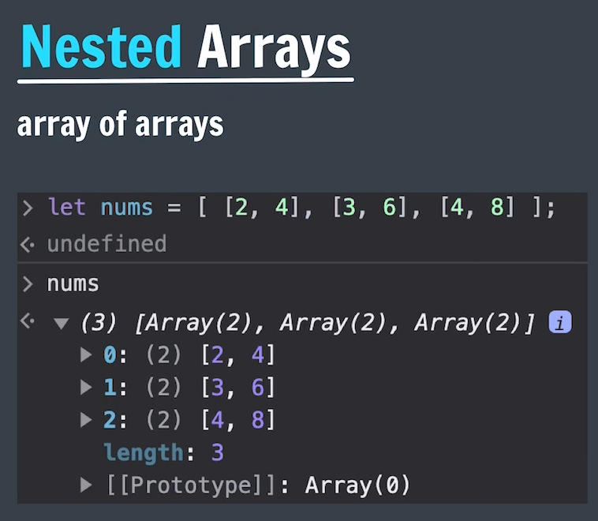

# JS III - Strings & Arrays

---

## Functions vs methods

| Function | Method |
| --- | --- |
| Function — a block of code that perform a specific task | Method — a block of code that are associated with an object. |
| A function is independent and doesn't need any object | A method is a function, which is linked with any object.  |
| We can directly call the function with its name | method is called by the object's name only |
| Function is used to pass or return the data | method operates the data in a class |
| Functions can only work with the provided data | methods can access all the data provided in the given class. |

## String Methods

Strings → Sequence of Characters

Methods → Actions that can be performed on Objects

- Methods are called/executed using a dot operator ( `.` ) followed by parenthesis → `obj.method( )`
- Ex: log( ), error( ), warning( ) from the console → console.log( )

<aside>
💡

NOTE:

---

<aside>
💡

Strings Methods in JS are `immutable` → any operations performed on the string will give a new string without mutating/Changing the original

- i.e., when you modify a String using Methods, It will retain the Original String as it is But returns a new string with modified data

Similarly, JS Strings are also `immutable`

</aside>

</aside>

```jsx
let str = "Hello GFG";
str.replace("Hello", "Bye");
console.log(str)     // Hello GFG [ due to Immutability ]

let str = "Hello GFG";
str[0] = "G";
console.log(str);    // Hello GFG [ due to Immutability ]
```

`str.trim( )` 

- `str.trim( )`  → trims the whitespaces from both the ends && returns a new string
    - It doesn’t effect the spaces in between the characters
    - It returns a new string & doesn’t effect the original [ Since, strings are immutable in JS ]

`str.toUpperCase( )` → Converts all the characters in the string to Upper Case

`str.toLowerCase( )` → Converts all the characters in the string to Lower Case

- Both of these above methods also returns a new string & doesn’t effect the original

## Function parameters (vs) Arguments

- The `parameter`  is referred to as the variables that are defined during a function declaration or definition.
- An `argument`  ****is referred to the values that are passed (and received by) within a function during a function invocation or execution or calling

```jsx
function functionName(parameter1, parameter2, parameter3) {
  // code to be executed
}

functionName(50, "Apna", true); //arguments
```

`str.indexOf( arg )` 

- It returns the index of 1st occurrence of the argument passed.
- Here arguments maybe a single character or a substring
- It returns `-1` if nothing found in the string
- `"apnaCollege".indexOf("naC")` → 2

## Method Chaining

- Executing one method after another immediately.
- The order of execution will be from left → right
- `str.trim().toUpperCase()`

```jsx
let str = "   Hello   ";

let newStr = str.trim();
console.log(newStr);

let finalStr = newStr.toUpperCase();
console.log(finalStr);

//We can do above 2 operations in a single line using "Method Chaining"
console.log(str.trim().toUpperCase());
```

`str.slice( )` 

- `str.slice( )`  → It returns a part of the original string as a new string [ Doesn’t effect original String ]
- There are 5 ways to use this slice method
    - slice(s, e) → it prints from index `s` until & excluding index `e`
    - slice(s) → prints from index `s` to end
    - slice(-x) → it takes the input as (length-x) & prints from that (length-x == -x) index to end.
    - slice( ) → returns the original string as a new string
    - slice( x ) → if x ≥ length then empty string
- This `.slice()` method is very similar to `.subString()` but the former is more direct & intuitive

`str.replace( )` 

- it searches & replaces the specified substring [ 1st Occurrence only ] with the mentioned substring
- It returns a new string & doesn’t effect the original
- `str.replace("original", "new")` → replaces the string “original” with “new” & returns the new one with replaced

`str.repeat()` 

- it repeats the original string with mentioned number of times
- It returns a new string & doesn’t effect the original
- `"new".repeat(x)` → if x=3 then “newnewnew”

```jsx
/**
 *  Qs. For the Give String :
            let msg = "help!";
        Trim it & convert it to uppercase.

    Qs. For the String -> let name = "ApnaCollege", predict the output for following :

                name.slice(4, 9)

                name.indexOf("na")

                name.replace("Apna","Our")

    Qs. Separate the "College" part in above string & replace 'l' with 't' in it.
*/

let msg = "help!";
console.log(msg.trim().toUpperCase());

let clgName = "ApnaCollege";
console.log(clgName.slice(4, 9));
console.log(clgName.indexOf("na"));
console.log(clgName.replace("Apna","Our"));

console.log(clgName.slice(4).replace('l','t'));
```

---

# Arrays

- Arrays are linear collection of Elements
    - Ex: `let arr = [12, 23, 4345, 21];`
- Arrays are `mutable` in JS
    - i.e., operations performed on arrays doesn’t gives us a new array but mutate the original array & returns it
- Characteristics
    - **0-Indexing** → It uses 0-based Indexing to access the elements
    - **Heterogeneous** → can store different types of data [ unlike Java, C++ ]
    - **Dynamic →** Arrays can grow or shrink in size [ Hence, No need to define size of Array ]
- `length` → gives the length of array [similar to strings]
- `typeof arr` → ‘object’

<aside>
💡

NOTE:

---

- Arrays doesn’t support Negative Indexing → Gives `Undefined`
- If index of Array > Length of Array → Gives `Undefined`
</aside>

```jsx
let nums = [1, 2, 3, 4, 5];
console.log(nums[0], nums[1], nums[4], nums[5], nums[-1]);

let info = ["GameBoy", 25, 99.9999, true, null, undefined]
console.log(info);
console.log(info, info[info.length-1]);
console.log(info[0].length);
console.log(info[0][0]);

// Arrays are Mutable
let names = [ "Tillu", "Killu", "Billu"];
names[0] = "Gillu";
console.log(names);

names[10] = "Willu";
console.log(names);
console.log(names[7]);
```

## Arrays Methods

`push` → adds at the end 

- && Returns the Length of Array

`pop` → removes at the end 

- & returns it [ it → removed element ]

`unshift` → adds at the start 

- && Returns the Length of Array

`shift` → removes at the start 

- & returns it [ it → removed element ]

```jsx
/**
 * 
    Qs. For the given start state of an array, change it to final form using methods.

          start : ['january', 'july', 'march', 'august' ]

          final : ['july', 'june' , 'march', 'august' ]
*/
let months = ['january', 'july', 'march', 'august' ];
months.shift();
console.log(months);

months.pop();
months.pop();
console.log(months);

months.push('june', 'march', 'august');
console.log(months)

// or

months = ['january', 'july', 'march', 'august' ];

months.shift();
months.shift();
console.log(months);

months.unshift('july', 'june');
console.log(months)
```

`indexOf( )` → returns the index of mentioned element & if not found returns -1.

`includes( )` → returns a Boolean value, if the array contains/includes the mentioned element

`concat` → concatenates/merges the arrays

- It returns a new array, But the original array will not mutate/change
- ex: `array1.concat(array2)`

`reverse` → reverses the elements of the original array [ mutates ]

`slice` [ Same as String Slice ]

- It returns a part of the original array as a new array [ doesn’t mutates ]
- It doesn’t mutates the original one, but returns a new array
- There are 5 ways to use this slice method
    - slice(s, e) → it prints from index s until & excluding index e
    - slice(s) → prints from index s to end
    - slice(-x) → it takes the input as (length-x) & prints from that (length-x) index to end.
    - slice( ) → returns the original array as a new array
    - slice( x ) → if x ≥ length then empty array

`splice`

- It removes/replaces/adds elements in mentioned index [ mutates ]
- It mutates the original array [ This is the diff b/w `splice` & `slice`]
- It can have 3 parameters [ last 2 are optional ]
    - splice( x ) → removes the elements starting from index x [ & returns those as an array ]
    - splice(x, y) → removes y elements starting from index x [ & returns those as an array ]
    - splice(x, y, ele1, ele2…) → removes ‘y’ elements starting from index ‘x’ AND adds the elements at index ‘x’ [ & returns those as an array ]
    - Syntax: `array.splice(startInd, delteCount, Element0...ElementN)`

```jsx
let array1 = [ 'red', 'yellow', 'green'];
let array2 = ['blue', 'orange', 'white'];
let colors = array1.concat(array2);

console.log(colors);
console.log(array1);
console.log(array2);

console.log(colors.splice(4));
console.log(colors);

console.log(colors.splice(0, 2));
console.log(colors);

console.log(colors.splice(0, 1, 'black', 'grey'));
console.log(colors);

console.log(colors.splice(1, 0, 'indigo'));
console.log(colors);

console.log(colors.splice(1, 1, 'violet'));
console.log(colors);
```

`sort`

- It sorts the array elements in ascending order
- It mutates the Original Array
- Actually sorting will happen based on the 1st char of each element

**Internal working**

- It 1st converts each element to string
- Then checks the 1st char of each elements & sorts in ascending order
    - if those are same, then checks for next char
- i.e., why number sorting happens differently using this method

```jsx
let array3 = ['blue', 'yellow', 'indigo', 'battleRed', 'green'];
console.log(array3.sort());
console.log(array3);

let array4 = [77, 15, 2, 25, 8, 87, 5, 68, 73, 13, 21];
console.log(array4.sort());
console.log(array4);
```

## Array References

Reference ⇒ Address in Memory [ in terms of programming ]

```jsx
let arr1 = [1, 2, 3];
let arr2 = [1, 2, 3];

arr1 == arr2   // false
arr1 === arr2  // false
```

- Here, arr1 doesn’t actually store the values of [1, 2, 3]
- arr1 will actually store the address of the 1st element. [ similarly arr2 ]
- Hence, arr1 & arr2 are not equal

```jsx
let arr3 = [1, 2, 3]
let arr4 = arr3;

arr4[0] = 5;
console.log(arr3); //[5, 2, 3]
```

- Here, we have given the reference of arr3 to arr4
- Hence, both arr3, arr4 will point out to same memory location
- i.e., why if we made changes to one, the other one will also get affected. since both of them point to same values

## Const Arrays

- WKT, `const` ⇒ no re-declaration & re-assignment
- `const arr = [1, 2, 3]`
    - Here WKT, arr stores the memory add but not the actual values
    - As we made arr const, we cannot re-assign arr [ like arr = [3, 5, 6] or cars [another array] ]
    - But all the array methods can be used on this array & change the values [ like arr.push(3) ]
- This is Possible as Arrays stores the Reference but NOT the actual Value

```jsx
const arrr = [1, 2, 3, 4];
console.log(arrr.push(6));
console.log(arrr);
console.log(arrr.splice(0, 1, 10));
console.log(arrr);
console.log(arrr.concat(array1));
console.log(arrr);
console.log(arrr.reverse());
```

## Nested Arrays




```jsx
/**
 *  Qs. Create a nested array to show the following tic-tac-toe game state.
 *                  X |   | O
 *                 ----------
 *                    | X | 
 *                 ----------
 *                  O |   | X
*/
let game = [['X', null , 'O'], [null, 'X', null], ['O', null, 'X']];
console.log(game);
game[0][1] = 'O'
console.log(game);
```