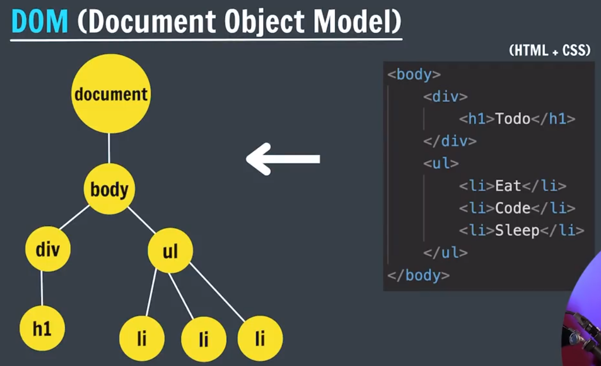

# JS IX - DOM

---

## DOM

- DOM → Document Object Model
    - DOM represents the **structure of an HTML document as a Tree of Nodes [ objects ]**
    - DOM allows us to Interact & manipulate this Structure/Content [ like HTML & CSS ] using JS
        - JavaScript uses the DOM to **read and manipulate** HTML and CSS.
        - Changes made to this tree of Objects will directly reflect in the HTML document/Web-Page
        - This allows web pages to be **dynamic** and **interactive**.

WKT, 

- DOM represents HTML Document as Tree of Nodes/Objects
    - Each element, attribute, and piece of text in the HTML becomes a **node**.
        - And the Topmost Node is called `document`
            - The `document` Node is the **entry point** to the DOM.
        - each individual Node is an individual Object
        - Hence, Each element in HTML will be available as an JS object
        - So, we can access these HTML elements as JS objects & manipulate them.
            - In this way we can manipulate the webpage contents using JS [ with the help of DOM ]
- As `document` node is the Entry point to DOM
    - To manipulate this tree of Nodes/Objects, we need access to this `document` node
    - This `document` node is made available as JS object through Browser [ Once HTML is Loaded ]
    - Hence, Through this `document` Object, we can Access each element in HTML



<aside>
💡

NOTE:

---

- WKT, `window` is an inbuilt object of JS
- similarly, `document` object will get created, Once HTML is loaded in Browser
- As explained earlier, all the elements of HTML will be accessible as JS objects using this `document` object
    - To print all the objects of `document`
        - we need to use `console.dir(document)` [ It is `dir` function NOT the `log` function ]
        - If we use `log` function, it will print the HTML code
</aside>

## How to manipulate..?

- It is a 2 step process
    - **Selection** → select the HTML Element
    - **Manipulation** → manipulate that Element using corresponding JS Object

<aside>
💡

NOTE:

---

- In Browser,
    - All the elements are available as `all` Collection inside `document` Object → `document.all`
    - Using this `all` collection, we select any particular element & manipulate it’s value/content
    - But as it is done in Browser, It is NOT a Permanent change
</aside>

## Selecting Elements

- We select an element in JS using a document’s methods like
    - `getELementById("id_name")` → Selects an Element based on ID & returns the element as an object or null [if Not found]
    - `getElementByClassName("class_name")` → Selects all Elements based on Class name & returns the elements as a collection or empty collection
    - `getELementByTagName("tag_name")` → Selects all Elements based on Tag name & returns the elements as a collection or empty collection
- **`QuerySelector`:**
    - Instead of using different methods for selecting elements, only one Method `querySelector()` is used to select any element
    - It’s main advantage is :
        - It Allows us to use ***any combination of CSS selector syntax*** as the arguments for this method
        - Ex: `document.querySelector("css_selector_syntax")`
    - But it will Always return the 1st occurrence as object [ Not Collection ]
- **`querySelectorAll`**:
    - Instead of returning 1st Occurrence as Single Object, It will return all the occurrences as a Collection [ Node List ]
        - Ex: `document.querySelectorAll("css_selector_syntax")`

```jsx
document.querySelector('p');         // Selects first p element

document.querySelector('#myId');     // Selects first element with id = myId

document.querySelector('.myClass');  // Selects first element with class = myClass

document.querySelectorAll("p");      // Selects all p elements

document.querySelectorAll("div a");  // Selects all a elements inside div
```

## Manipulation

1. Using ***Properties***
    - `innerText`
        - Only displays the actual content visible to us on webpage
            - It won’t display any hidden or HTML markup & can’t understand it during manipulation
        - During Manipulation, It takes Input as String [ CANNOT understand Markup ]
    - `textContent`
        - It will display all of the text content written in HTML [ `index.html` ] document as it is, without markup
            - It will display hidden content as well.
        - During Manipulation, It takes Input as String [ CANNOT understand Markup ]
    - `innerHTML`
        - It will display all of the text content written in HTML document as it is, with markup
        - During Manipulation, It takes Input as String & Markup [ Markup is actually reflected on webpage ]
2. Using ***Attributes***
    - `obj.getAttribute("attr")` → Used to get the attribute value
    - `obj.setAttribute("attr", "new_value")` → used to set/modify the attribute value
    - Both of these methods are executed on HTML Element Object [ NOT on document Object ]
    - These methods deal with **HTML attributes**, not DOM properties.
        - Ex: `element.getAttribute("class")` accesses the `class` attribute, while `element.className` accesses the DOM `className` property.
3. Using **`*style` object***
    - This `style` is an object inside each element
    - we can manipulate the style of an element using this `style` object
        - CSS property names that have hyphens (`-`) must be written in **camelCase**.
        - The values must be in string format, including units (`"px"`, `"em"`, etc.).
    - NOTE:
        - Set Multiple Styles with `cssText`
            - `element.style.cssText = "color: red; background-color: yellow; font-size: 18px;";`
        - We can SET **multiple properties individually using the `style` object**
            - It Does NOT overwrite the entire `style` object.
    
    <aside>
    💡
    
    NOTE:
    
    ---
    
    - This `style` object will ALWAYS set & display the properties of “***inline***” styles
        - Even if there are external/internal styles maintained for that element, they are not manipulated using the `style` object
        - Hence, whatever the style set using `style` object, it will be the “inline” CSS only
    - Hence, it is NOT a good practice to change CSS style using JS [ As it Overwrites the CSS Style Hierarchy ]
    </aside>
    
4. Using `classList`
    - `obj.classList` → will return all the classes mapped for that element
        - `classList.add(”class_name”);` → will add a new class to that element
        - `classList.remove(”class_name”);` → will remove the class from that element
        - `classList.toggle(”class_name”);` → will toggle between add & remove the class [ If added, it will remove & Vice versa ]
        - `classList.contains(”class_name”);` → checks if class exists or not
        
        <aside>
        💡
        
        NOTE:
        
        ---
        
        - the major difference between `classList.add(”class_name”);` & `obj.setAttribute("class", "new_value")` is:
            - Former will add indefinite number of classes to the element [ like append the classes ]
            - Later will overwrite the existing ones or create a new one,
                - i.e., Adds Only 1 attribute [ CANNOT add multiple properties ]
                - And Finally we will be having only single class.
        - Hence, we only use `classList.add(”class_name”);`
        </aside>
        

## Navigation

- we can navigate between the objects using the following methods
    - `parentELement` → we can go to object’s parent & ONLY 1 parent exists for 1 object
    - `childElement` → we can get collection of children for an object using this.
    - `previousElementSibling` & `nextElementSibling` → used to navigate between siblings

## Adding Elements

Until now, 

- we have seen how to Select & Manipulate the elements in a document
- But now, we will see how to Create & Add an element in the document

It will have 2 steps:

1. Create the element → `document.createElemenet(”HTML_tagName”)`
    - This creates the element in the document
2. Insert the element 
    - `appendChild()` method → Appends a node (element) as the last child of an element.
        - Can Insert ONLY one Node && Element ONLY [ NO Text ]
    - `append()` method → Appends/Inserts the specified content/Element at the end of the selected same element. [ like string append ]
    - `prepend()` method → Inserts the specified content/Element  at the beginning of the selected element.
        - Both of these 2 methods CAN Insert Multiple Nodes [ both Elements & Text ]
    - The `insertAdjacentElement()` method → Inserts an element at a specified position [ relative to Target Element ]
        - `*element*.insertAdjacentElement(*position, element*)`
        - `position` values:
        
        | Value | Meaning |
        | --- | --- |
        | `"beforebegin"` | Before the element itself [ like a sibling element ] |
        | `"afterbegin"` | Inside the element, before its first child [ it will become 1st child ] |
        | `"beforeend"` | Inside the element, after its last child [ it will become last child ] |
        | `"afterend"` | After the element itself [ like a sibling element ] |

### 🔍 Summary Table

| Feature | `insertAdjacentElement("beforeend")` | `appendChild()` | `append()` |
| --- | --- | --- | --- |
| Accepts DOM element | ✅ Yes | ✅ Yes | ✅ Yes |
| Accepts multiple elements | ❌ No | ❌ No | ✅ Yes |
| Accepts text | ❌ No | ❌ No | ✅ Yes |
| Accepts position control | ✅ Yes (via position string) | ❌ No | ❌ No |
| Inserts as last child | ✅ Yes (with `"beforeend"`) | ✅ Yes | ✅ Yes |
| Inserts outside the element | ✅ Yes (with `"afterend"`, etc.) | ❌ No | ❌ No |

### ✅ When to Use Which

| Use Case | Best Method |
| --- | --- |
| Insert element **at a specific position** | `insertAdjacentElement()` |
| Insert a **single DOM element** at end | `appendChild()` or `insertAdjacentElement("beforeend")` |
| Insert **multiple elements or mixed content** | `append()` |

## Removing Elements

Similar to how we can add elements using DOM, we can remove elements too

- The `removeChild()` method → Removes an element's child from the document [ at any position, NOT the last Child ]
- The `remove()` method removes an element (or node) from the document.

<aside>
💡

NOTE:

---

- If we use 2 JS files like
    - `app.js`
    - `main.js`
- The variables from 1 file can be used in other file
    - Hence, If we define 2 variables with same names in each file,
    - Then console will throw error
</aside>

## Practice Qs

```jsx
<!DOCTYPE html>
<html lang="en">
<head>
    <meta charset="UTF-8">
    <meta name="viewport" content="width=device-width, initial-scale=1.0">
    <title>Practice Qs</title>
    <link rel="stylesheet" href="./style.css">
</head>
<body>
    <div id="container"></div>

    <script src="./app.js"></script>
    <script src="./assignment.js"></script>
</body>
</html>
```

```jsx
.red {
    color: red;
}
```

```jsx
/**
Practice Qs
-----------
    Add the following elements to the container using only JavaScript and the DOM methods.

            i) a <p> with red text that says "Hey I'm red!"

            ii) an <h3> with blue text that says "I'm a blue h3!"

            iii) a <div> with a black border and pink background color with the following elements inside of it:

            . another <h1> that says "I'm in a div"

            · a <p> that says "ME TOO!"
*/
let container = document.querySelector("#container");

// i) a <p> with red text that says "Hey I'm red!"
let p1 = document.createElement("p");
p1.innerText = "Hey I'm red!";
p1.classList.add("red");

container.appendChild(p1);

// ii) an <h3> with blue text that says "I'm a blue h3!"
let h3 = document.createElement("h3");
h3.innerText = "I'm blue h3!";
h3.style.color = "blue";

container.appendChild(h3);

/**
 * iii) a <div> with a black border and pink background color with the following elements inside of it:

            . another <h1> that says "I'm in a div"

            · a <p> that says "ME TOO!"
*/
let div = document.createElement("div");
div.style.backgroundColor = "pink";
div.style.borderColor = "black";
div.style.border = "solid 1px black";
div.style.paddingLeft = "10px";

container.appendChild(div);

let divH3 = document.createElement("h3");
divH3.innerText = "I'm in a div";

div.appendChild(divH3);

let divP = document.createElement("p");
divP.innerText = "ME TOO";

div.appendChild(divP);
```

## Assignment

```jsx
/**
    Qsl. Create a new input and button element on the page using JavaScript only. Set the
    text of button to "Click me'.

    Qs2. Add following attributes to the element :
        - Change placeholder value of input to "username"
        - Change the id of button to "btn',

    Qs3. Access the btn using the querySelector and button id. Change the button background
    color to blue and text color to white.

    Qs4. Create an hl element on the page and set its text to "DOM Practice" underlined.
    Change its color to purple.

    Qs5. Create a p tag on the page and set its text to "Apna College Delta Practice",
    where Delta is bold.
*/
let container2 = document.createElement("div");
document.querySelector("body").appendChild(container2);
container2.style.border = "2px solid black";
container2.style.marginTop = "10px";
container2.style.padding = "10px";

// Q1
let input1 = document.createElement("input");
input1.type = "text"

let button1 = document.createElement("button");
button1.innerText = "CLick me";

container2.appendChild(input1);
container2.appendChild(button1);

// Q2
input1.placeholder = "Username";
input1.id = "inp1"
button1.id = "btn";

// Q3
let btn = document.querySelector("#btn");
btn.style.color = "white";
btn.style.backgroundColor = "blue";

// Q4
let h1 = document.createElement("h1");
h1.innerText = "DOM Practice";
h1.style.color = "purple";
h1.style.textDecoration = "solid 2px underline"

document.querySelector("body").prepend(h1);

// Q5
let p2 = document.createElement("p");
p2.innerHTML = "DOM <b>Maipulation</b> Assignment Solution"

container2.appendChild(p2);

```